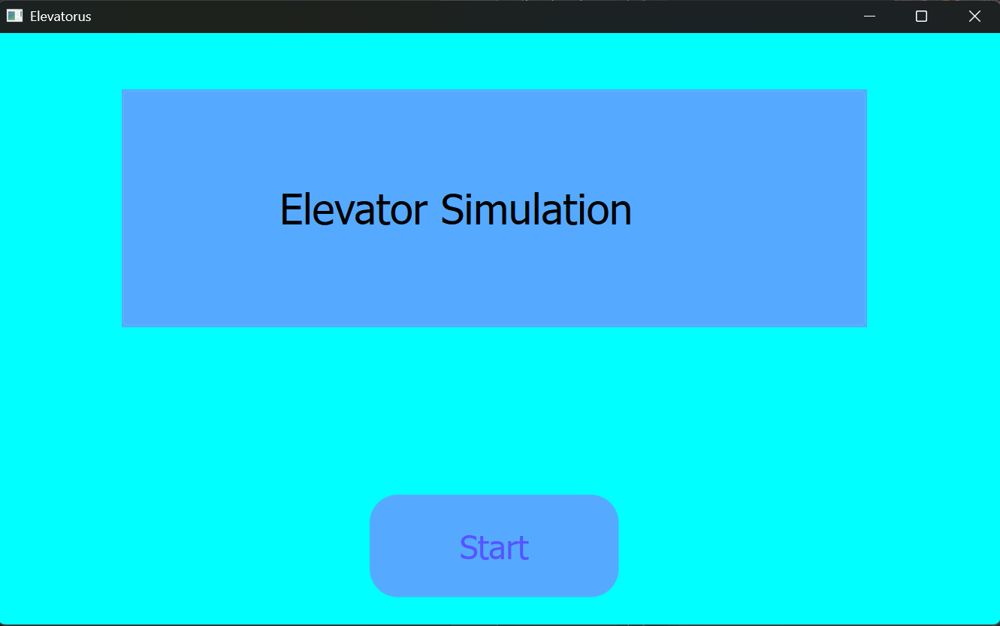
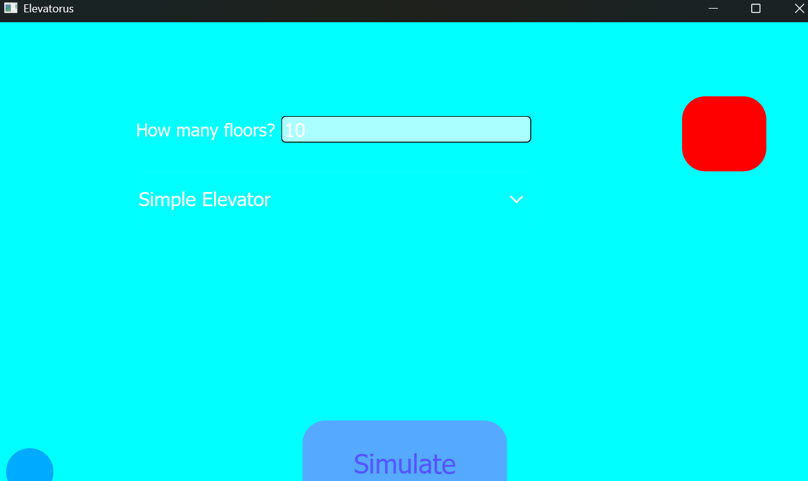
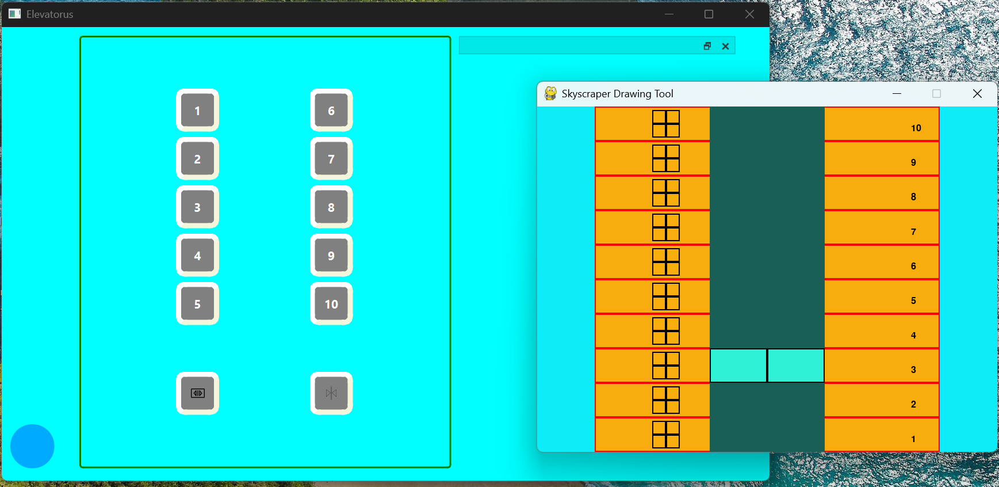
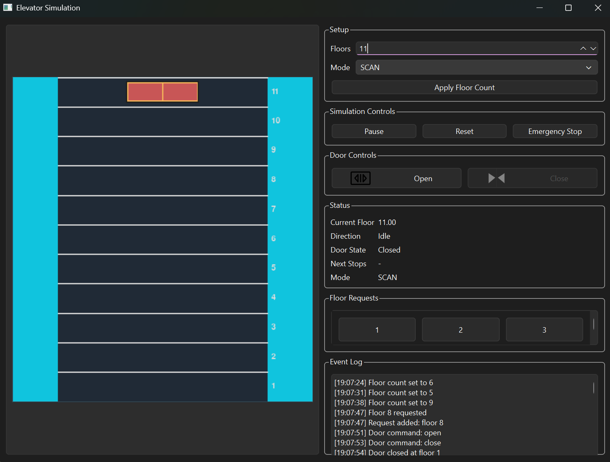
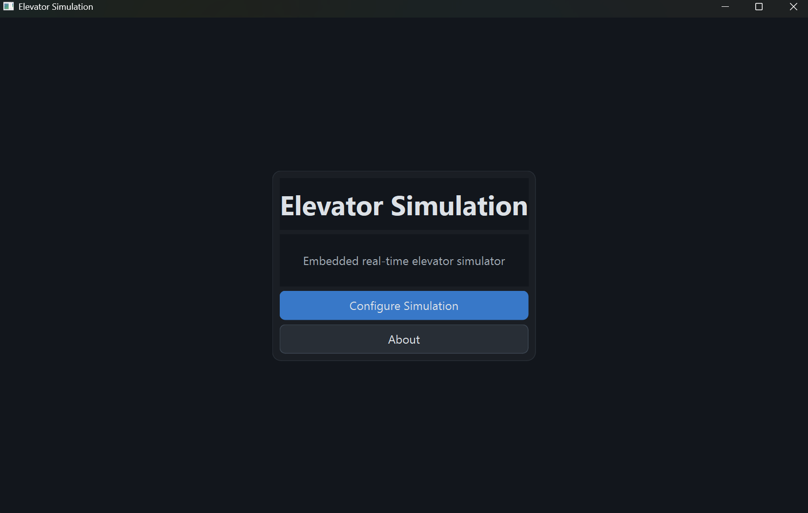
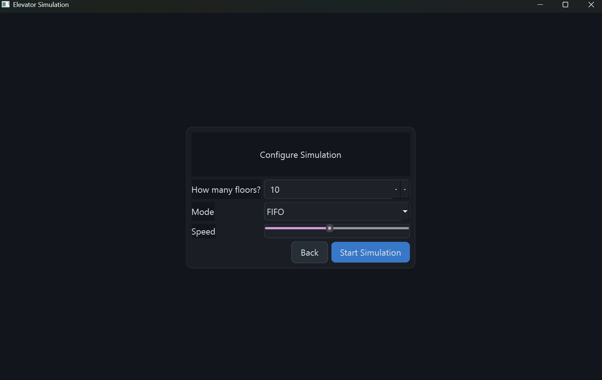
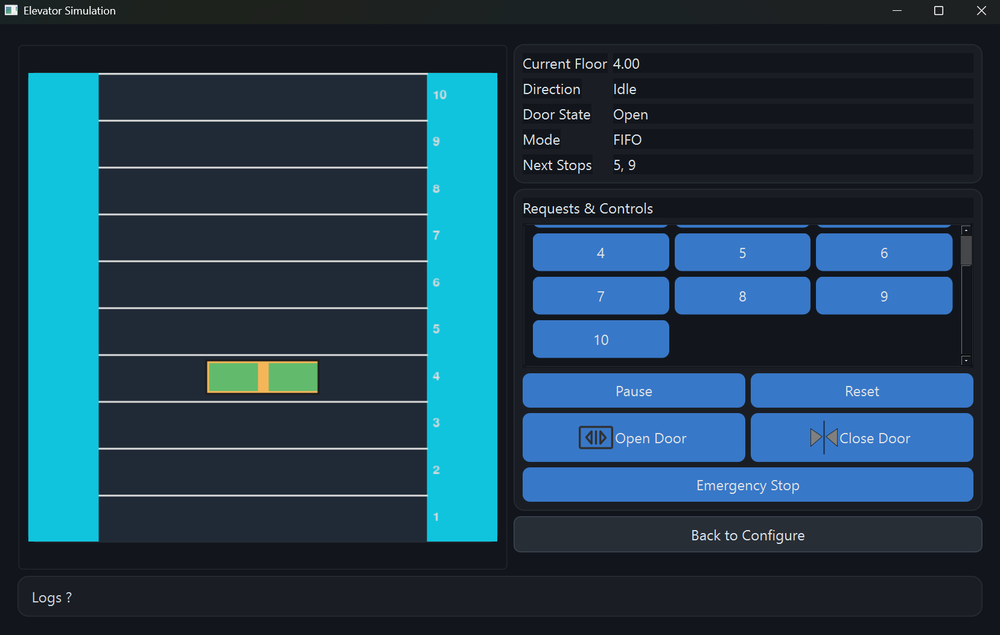

# Elevator Simulation

A desktop elevator simulator built with PySide6 and embedded real-time rendering. Originally started in early 2023.

## Overview

Elevator Simulation is a desktop application that models an elevator as a real-time system, not a toy script. It explores interactive simulation, scheduling policies and state machines under continuous user input. The focus is system behavior and responsiveness: the UI is there to expose the mechanics, not to hide them.

## Motivation & Purpose

An elevator is a deceptively rich system. It has queues, scheduling choices, state transitions and the need to respond immediately to real-time input. That combination made it a perfect target for learning how event-driven UIs and simulation loops interact and for practicing clear separation between logic and presentation. The goal was to build a real application that could be evolved and refactored, not a one-off demo.

## Project Evolution

### Iteration 1  Early Prototype (2023)

- Single-page application
- Rough UI, inconsistent colors
- Logic and UI tightly coupled
- Blocking simulation loop
- Goal: understand PySide6 basics and Pygame rendering

Screenshots: 3 images showing the early prototype UI





### Iteration 2  Single-Page Redesign

- Improved layout and visual structure
- Cleaner controls and floor selection
- Better separation inside the same page
- Still limited by architectural constraints

Screenshot: 1 image showing the redesigned single-page version



### Iteration 3  Multi-Page UI + Embedded Simulation

This iteration introduced a multi-page with embedded simulation flow.

- Start, Configure, and Simulation pages
- Embedded simulation inside the Qt UI
- Removal of separate simulation window
- Requests and controls unified for better usability
- Logs moved to a secondary, non-intrusive area

Screenshots: 3 images showing the final multi-page embedded simulation UI





## Scheduling Modes

Simple: only the most recent request is kept, so a new call overwrites the previous target. Example: requests 2, 5, 3 -> serves 3.

FIFO: requests are queued and served in the order they were added. Example: requests 2, 5, 3 -> serves 2, then 5, then 3.

SCAN: the elevator continues in its current direction, serving requests ahead, then reverses to handle remaining requests behind. Example: start at 2 going up with requests 5, 1, 3 -> serves 3, 5, then 1.

## Key Technical Challenges & Solutions

Integrating Pygame and PySide6 is not straightforward because both expect to manage a main loop. A naive approach leads to blocking behavior and a frozen UI. The solution here is to let Qt own the event loop and drive the simulation using a QTimer. Pygame renders to an offscreen Surface, which is converted into a QImage and then displayed inside Qt. This keeps the interface responsive while still rendering frames at a steady cadence without a blocking while loop.

## Door State Machine

The doors are modeled as a proper state machine: CLOSED -> OPENING -> OPEN -> CLOSING -> CLOSED. This matters because motion and user commands are constrained by state. The elevator cannot move unless doors are fully closed, and door commands can extend or shorten dwell time. Modeling this explicitly avoids edge cases and makes the system predictable under rapid user interaction.

## UI / UX Design Decisions

Requests and controls are kept visible together so operators do not have to switch context while interacting with the system. Logs are secondary and collapsible, which keeps the operating surface uncluttered but still traceable. Configuration is separated from operation to reduce cognitive load during simulation. Tabs were removed where they hid important controls behind an extra step. The result is a layout that emphasizes the flow of operation rather than the density of options.

## Core Technologies Used

- Python: application logic, state machines, and scheduling policies
- PySide6: Qt-based desktop UI, signals and slots, QTimer, and QStackedWidget for multi-page flow
- Qt Designer (.ui files): structured UI layout and consistent styling
- Pygame: offscreen Surface rendering and custom drawing logic displayed inside Qt

## Project Structure

```
src/elevator_sim/
  app.py
  ui/
    main_window.py
    ui_files/
      Elevator_Interface_updated.ui
  core/
    model.py
    scheduler.py
    controller.py
    events.py
  render/
    pygame_canvas.py
```

The separation between UI, core logic, and rendering keeps the simulation testable and avoids mixing Qt or Pygame concerns into the state machine.

## Running the Project

Windows setup:

```powershell
python -m venv .venv
.\.venv\Scripts\Activate.ps1
pip install -r requirements.txt
$env:PYTHONPATH = "src"
python -m elevator_sim
```

No environment variables or external services are required beyond the `PYTHONPATH` entry to run from the `src` layout.

## What This Project Demonstrates

- Event-driven desktop systems with responsive UI behavior
- Real-time simulation without blocking the interface
- Explicit state machines and scheduling logic
- Iterative refinement over time
- Architectural separation of concerns
